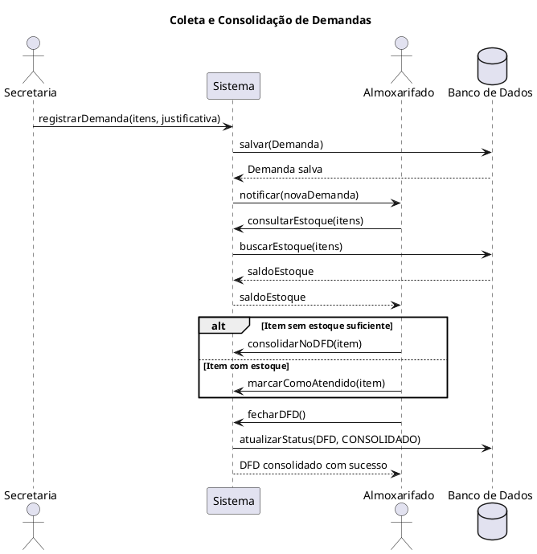

# Grupo 04 — Diagramas de Sequência

## 🎯 Responsabilidade

Modelar os **diagramas de sequência UML** dos fluxos mais críticos do sistema, mostrando a interação temporal entre atores, objetos e sistemas externos.

---

## 📋 O que entregar

### Artefatos: Um diagrama por fluxo (mínimo 4)

| Arquivo | Fluxo |
|---------|-------|
| `SEQ-01-coleta-demandas.png` + fonte | Coleta e consolidação de demandas no DFD |
| `SEQ-02-cotacao-precos.png` + fonte | Realização de cotação via Banco de Preços |
| `SEQ-03-emitir-ordem-fornecimento.png` + fonte | Emissão de OF com rastreamento |
| `SEQ-04-envio-prefeitura.png` + fonte | Envio do processo à Prefeitura via 1doc |

---

## 🔍 O que cada diagrama deve mostrar

### SEQ-01: Coleta e Consolidação de Demandas
- Secretaria registra demanda no sistema
- Sistema notifica Almoxarifado
- Almoxarifado verifica estoque
- Almoxarifado consolida em DFD
- Sistema verifica regra de fracionamento (RN-03)
- DFD é aprovado e encaminhado ao setor de Compras

### SEQ-02: Cotação de Preços
- Chefe de Licitações inicia cotação para um item
- Sistema consulta Banco de Preços (externo)
- Banco de Preços retorna preços de processos anteriores
- Sistema sugere valor médio de referência
- Usuário valida / ajusta valor
- Sistema registra cotação associada ao ETP

### SEQ-03: Emissão de Ordem de Fornecimento
- Chefe de Compras seleciona item da Ata SRP
- Sistema verifica validade da ata
- Sistema verifica se quantidade solicitada ≤ saldo da ata
- Usuário preenche OF
- Sistema gera OF numerada
- Sistema notifica Contabilidade (empenho pendente)
- Sistema atualiza saldo da ata

### SEQ-04: Envio do Processo à Prefeitura
- Processo completo (DFD + ETP + TR) aprovado internamente
- Jurídico interno valida e assina
- Sistema empacota documentos
- Sistema envia via 1doc à Prefeitura
- Prefeitura confirma recebimento e autua o processo
- Sistema registra número de autuação

---

## 🛠️ Ferramentas Recomendadas

| Ferramenta | Link | Observação |
|-----------|------|------------|
| **PlantUML** | [plantuml.com](https://plantuml.com) | Melhor para diagramas de sequência textuais |
| **SequenceDiagram.org** | [sequencediagram.org](https://sequencediagram.org) | Online, simples, exporta PNG |
| **Mermaid** | [mermaid.live](https://mermaid.live) | Integra com GitHub |
| **draw.io** | [app.diagrams.net](https://app.diagrams.net) | Alternativa visual |

### Exemplo PlantUML — Sequência básica:



---

## 📁 Estrutura esperada da pasta

```
grupo-04-diagramas-sequencia/
├── README.md
├── SEQ-01-coleta-demandas.puml
├── SEQ-01-coleta-demandas.png
├── SEQ-02-cotacao-precos.puml
├── SEQ-02-cotacao-precos.png
├── SEQ-03-emitir-ordem-fornecimento.puml
├── SEQ-03-emitir-ordem-fornecimento.png
├── SEQ-04-envio-prefeitura.puml
└── SEQ-04-envio-prefeitura.png
```

---

## ✏️ Seção de Entrega (preencher pelo grupo)

**Integrantes:**
- ...

**Decisões tomadas:**
> ...

**Limitações identificadas:**
> ...
